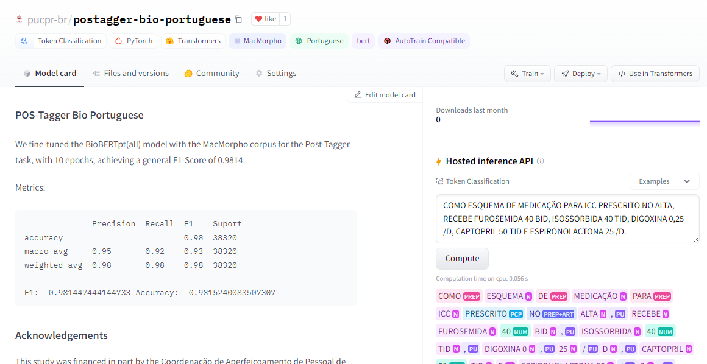

# Nlp Bio Portuguese Chunking
## An API for extracting chunks (Noun phrases) in clinical texts
### "*Chunk Is All You Need*" 😄😄😄

To read in Portuguese, click here:  [README in portuguese](https://github.com/lisaterumi/nlp-portuguese-chunking/blob/main/READMEpt.md)

# Index
1. [About](#about)
2. [POS-Tagger](#pos-tagger)
3. [How to run-locally](#how-to-run-locally-to-extract-the-chunks)
4. [Running via docker](#running-in-container-via-docker)
5. [How to cite](#how-to-cite)

## About

Chunking is a way of grouping sequential elements from text (sentences), which can be noun phrase, verb phrase, prepositional phrase etc, using its part of speech (POS) tags. Unlike named entity recognition (NER), which finds and sorts relevant pieces of text.

In this work, we extract the noun phrases (phrases that have a noun as their head).

We use two methods to generate the POS-tags of sentences:

1. The `spacy` library, to tokenize and extract the POS-tag of each word of the sentence, which uses the corpus `pt_core_news_md`.
2. A token-sequence `BERT` model trained with the corpus [`MacMorpho`](http://nilc.icmc.usp.br/macmorpho/), using as checkpoint the [BioBERTpt model]( https://huggingface.co/pucpr/biobertpt-all), trained with clinical and biomedical texts in Portuguese.

Next, we create a function that extracts all the nouns from the sentence, grouping with its complements (adjectives, adverbs, etc).

Example:


```
---Original sentence:---

Data de Criação do Documento: 22/04/2014   Dispneia importante aos esforços + dor tipo peso no peito no esforço. Obeso, has, icc  c # cintilografia miocardica para avaliar angina.


---Sentence´s chunks:---

['Data de Criação do Documento 22/04/2014', 'Dispneia importante aos esforços', 'dor tipo peso no peito no esforço', 'Obeso', 'has', 'icc', 'cintilografia miocardica', 'angina']
```

## POS-Tagger

In addition to the POS-tagger model provided by `spacy`, we also trained our own model using the fine-tuning of the language model [BioBERTpt(all)](https://huggingface.co/pucpr/biobertpt-all) with the corpus for Portuguese [MacMorpho](http://nilc.icmc.usp.br/macmorpho/), with 10 epochs, reaching an overall F1-Score of **0.9814**.

Our model is in the official repository of `Hugging Faces`, you can access it through the address: https://huggingface.co/pucpr-br/postagger-bio-portuguese.



If you appreciate our work, don't forget to like the model on `Hugging Faces` ❤️

How to use the POS-tagger model (without the chunking part):

```
from transformers import AutoTokenizer, AutoModelForTokenClassification

tokenizer = AutoTokenizer.from_pretrained("pucpr-br/postagger-bio-portuguese")

model = AutoModelForTokenClassification.from_pretrained("pucpr-br/postagger-bio-portuguese")
```

Here you have the grammatical types returned by the model:

| Acronym | Meaning |
| -------------------- | -------------------- |
| ADJ | adjective |
| ADV | adverb |
| ADV-KS | Subordinate subjunctive adverb |
| ADV-KS-REL | Subordinate relative adverb |
| ART | Article |
| CUR | currency |
| IN | Interjection |
| KC | Coordinating conjunction |
| KS | Subordinating conjunction |
| N | noun |
| NPROP | Proper noun |
| NUM | Number |
| PCP | Participle |
| PDEN | Denotative word |
| PREP | Preposition |
| PROADJ | Adjective pronoun |
| PRO-KS | Subordinate subjunctive pronoun |
| PRO-KS-REL | Subordinate connective relative pronoun |
| PROPESS | Personal pronoun |
| PROSUB | Noun pronoun |
| V | verb |
| VAUX | auxiliary verb |

More information and examples at: http://nilc.icmc.usp.br/macmorpho/macmorpho-manual.pdf

PS: In case you need other POS-taggers trained for the portuguese language, in clinical or medical domain, you can also try these [models trained with Flair](https://github.com/HAILab-PUCPR/portuguese-clinical-pos-tagger).

## How to run locally to extract the chunks

To generate the chunks (noun phrases), you can run it directly from these notebooks: [with spacy](https://github.com/lisaterumi/nlp-portuguese-chunking/blob/main/notebook/chunking-portuguese_spacy.ipynb) and with [POS-Tagger Bio Portuguese](https://github.com/lisaterumi/nlp-portuguese-chunking/blob/main/notebook/chunking-portuguese_postagger_biopt.ipynb)

Or run a server to access via an web interface, following the steps below (the following examples are using the `spacy` library, as it is a lighter model to run, especially within containers).

1. Clone this repository
2. Install the necessary libraries (if you prefer, use [Anaconda](http://www.anaconda.com))

```
pip install flask == 4.3.0
pip install spacy == 2.3.7
```
or through the command:

```
pip install -r requirements.txt
```
3. Run `app.py` (it is configured to run on port 5000)

```
python app.py
```
4. In the browser, go to http://localhost:5000/

5. Write a clinical sentence or select some example sentence and click in the search button.
 
All the chunks identified in the input sentence will be returned colored.
 


## Running in container via Docker

1. To run the API inside a `Docker` container, where it is not necessary to worry about the environment and libraries, just follow the steps:

1. If you don't have it, install `Docker` following [these guidelines](https://docs.docker.com/get-started/).

2. Run the following commands (to run the container on port 5000)
```
docker build -t chunking .

docker run --name chunking_instance -p 0.0.0.0:5000:5000  -d chunking

```
3. In the browser, go to http://localhost:5000/

## How to cite

** *soon* **
